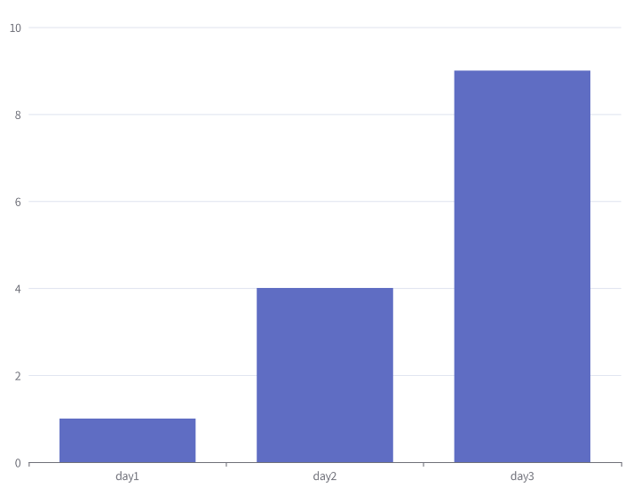

# pipe-charts

Generate charts from bash output.

## Install

```bash
npm install -g @sinm/pipe-charts
```

## Usage
```bash
echo -e "day1 1\nday2 4\nday3 9" | pipe-charts --type bar
```

output:



## LICENSE

MIT

This repo use fonts [Source Han Sans](https://github.com/adobe-fonts/source-han-sans/blob/release/LICENSE.txt)
